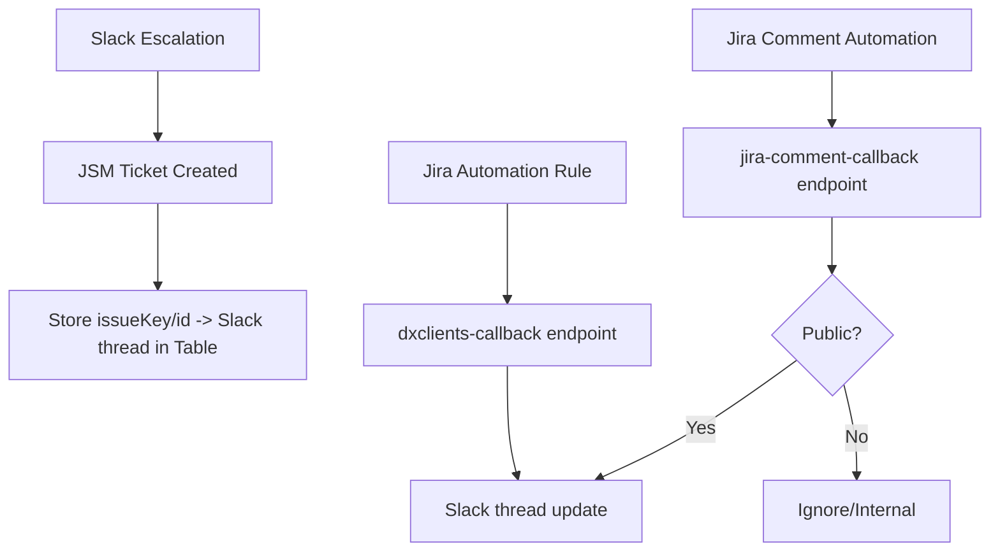

# Jira → Slack Thread Mirroring (Public Comments + Automation Results)

## Problem
When a Jira ticket is created from Slack, users lose visibility unless they constantly check Jira. Comment updates and automation outcomes often stay trapped in Jira, increasing context switching and “any update?” messages.

## Solution
Built a set of callback endpoints + table mapping so that:
- The system stores a mapping: **issueKey/issueId → Slack channel + thread_ts**
- Jira Automation posts structured results back into the originating Slack thread
- Jira comments are mirrored only when they are **Public** (customer-visible); internal notes are excluded

## Architecture (high level)

## What makes it solid
- **Thread continuity:** updates post into the same Slack thread (not a new message)
- **Public-only policy:** reduces risk of internal note leakage
- **Flexible callback parsing:** supports JSON payloads and Jira-style formatted text blocks
- **Durable correlation:** uses Table Storage mapping (not ephemeral memory)

## Tech stack
Azure Functions (Python), Azure Storage Tables, Jira Automation + REST, Slack Web API

## Outcomes (estimates — adjust with your numbers)
- Reduced “any update?” follow-ups by **15–30%**
- Reduced context switching by **2–6 hours/week** across the team(s) using the workflow
