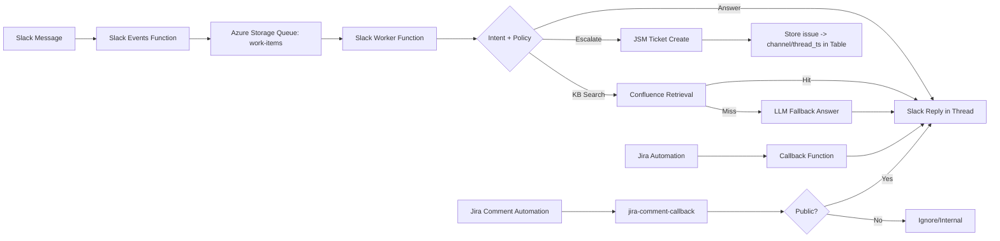

# Slack AI Service Desk Bot (Azure Functions + JSM + Confluence + LLM)

## Problem
Support teams lose time to repetitive questions, fragmented context, and slow escalations. Users ask in Slack, but the workflow to create/track tickets and get answers is inconsistent and labor-intensive.

## Solution (What I built)
A **queue-driven Slack AI bot** that:
- Listens to Slack Events and routes messages into an Azure Queue
- A worker function classifies intent and responds in-thread
- Uses **Confluence knowledge retrieval** first
- If KB retrieval returns no relevant results, it **falls back to an LLM answer** (so the user still gets help)
- Escalates to **Jira Service Management** when necessary
- Maintains thread continuity by storing mappings (issue → Slack channel/thread_ts)
- Mirrors **automation outcomes** and **public Jira comments** back into the originating Slack thread

## Architecture (high level)

## Reliability & Ops Features
- **Queue-based processing:** enables retries, throttling, and durable event handling
- **Thread-safe context:** every escalation is anchored to the original Slack thread
- **Structured diagnostics:** JSON diagnostics includes build identifiers and operational details
- **Deployment discipline:** full rebuild + full redeploy (no portal edits) to minimize drift

## Key behaviors implemented
- Multi-intent support routing
- Travel/work-from-travel guidance → directs users to a Travel Request form (no JSM ticket required)
- AI tools access workflow → directs users to an additional AI access request form (e.g., ChatGPT licensing)
- Ticket escalation when appropriate + automatic thread linking
- Jira automation callback posts results into the same Slack thread
- Mirrors **Public-only** Jira comments to Slack (excludes internal notes)

## Tech stack
Slack Events API, Slack Web API, Azure Functions (Python), Azure Storage Queues/Tables, Jira Service Management REST, Confluence API, LLM provider (e.g., Azure OpenAI), PowerShell/Azure CLI deployment pipelines.

## Outcomes (estimates — adjust with your numbers)
- **5–12 hours/week** reclaimed from deflected “how do I…?” and status questions
- **Time-to-first-response** improved from “queue dependent” to **~1–5 minutes** for common intents
- **Fewer context pings:** one less back-and-forth round-trip on escalated tickets on average

## What I’d improve next
- Thread-scoped short-term memory for follow-up questions
- Intent analytics dashboard (volume, deflection, escalation rate)
- RBAC/guardrails per channel/team

