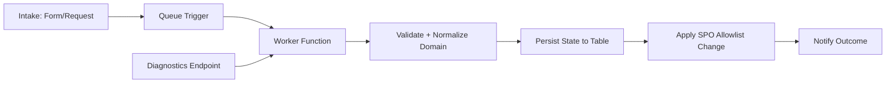

# SharePoint Online Domain Allowlist Automation (Governance Workflow)

## Problem
Managing SharePoint Online domain allowlists manually is slow, inconsistent, and risky—especially with frequent partner/vendor access needs. Governance requires auditable requests, controlled approvals, and reliable configuration updates.

## Solution
Built a governed workflow that:
- Accepts allowlist requests from approved intake channels (service catalog + automation triggers)
- Uses an Azure Functions pipeline to validate, queue, and apply changes
- Tracks request state in durable storage for auditing and retries
- Provides a diagnostics endpoint for operational troubleshooting

## Reliability improvements
- Correct Table REST upsert behavior to prevent 404/409 edge cases
- Proper OData headers + handling for 204 success responses
- Diagnostics endpoints always return JSON and include build identifiers
- Deployment strategy uses full package redeploy to prevent configuration drift

## Architecture (high level)

## Tech stack
Azure Functions, Azure Storage Tables/Queues, PowerShell/Azure CLI redeploy pipelines, SharePoint Online admin tooling/APIs.

## Outcomes (estimates — adjust with your numbers)
- Turnaround improved from **days → hours** for standard allowlist requests
- 100% audit trail: request state, timestamps, and outcomes captured durably
